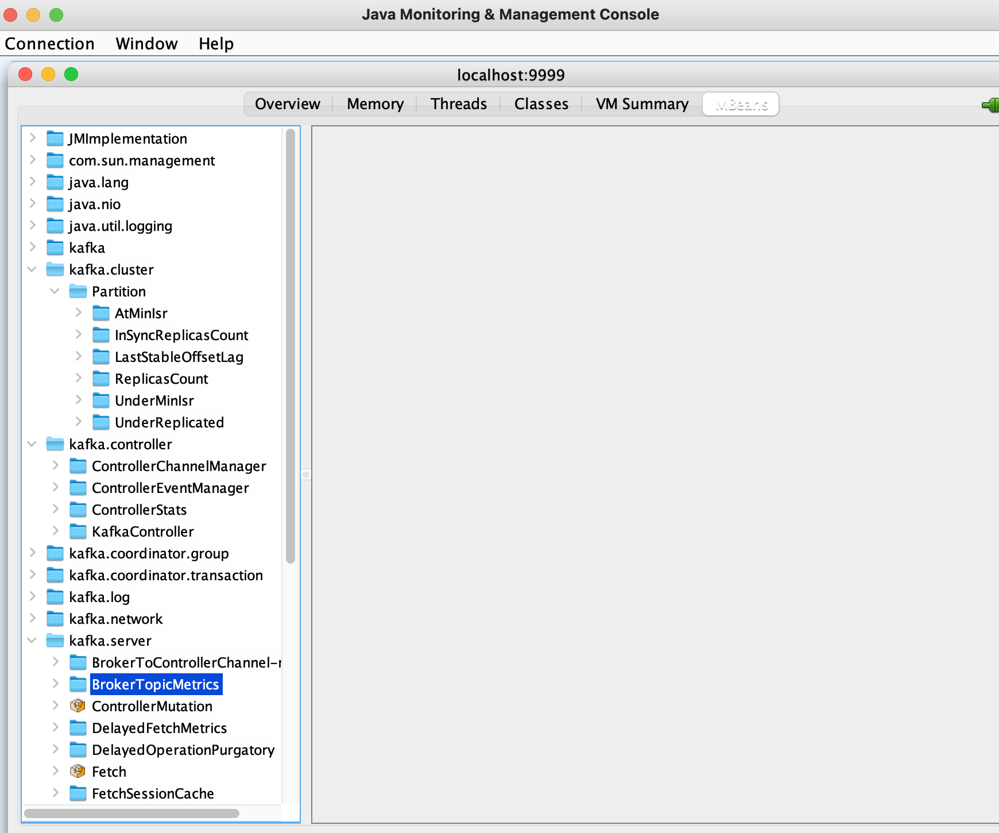
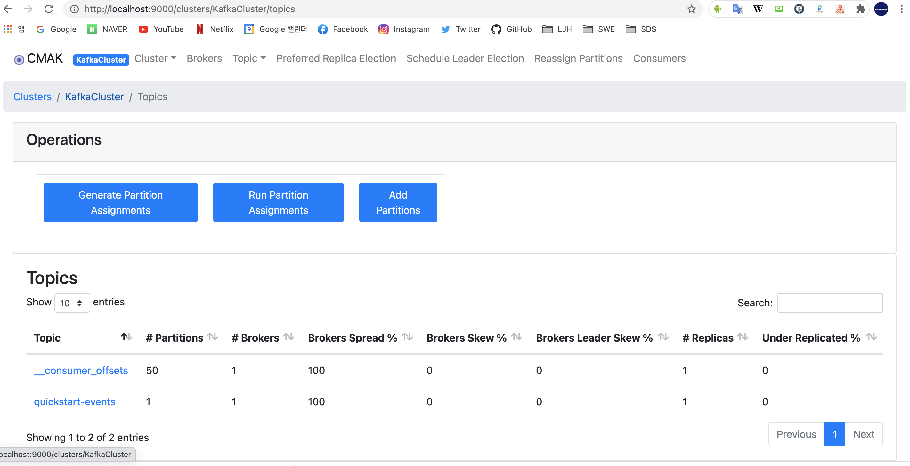

# Kafka Server JMX 설정하기  
Kafka-server-start.sh 파일 제일 위에 PORT 설정 추가합니다.  
~~~text  
export JMX_PORT=9999
~~~  

JMX 서비스가 정상적으로 기동되었는지 확인합니다.  
~~~text  
netstat -an | grep 9999
tcp46      0      0  *.9999                 *.*                    LISTEN  
~~~  

# JConsole을 통해 JMX 확인하기  

~~~text  
jconsole localhost:9999
~~~  

Jconsole을 통해 MBean 확인이 가능합니다.  

# Kafka Manager 설치  

[다운로드](https://github.com/yahoo/CMAK/releases) 링크를 통해 `cmak-3.0.0.5.zip` 을 다운로드 받습니다.  
  
### 준비사항  

[CMAK](https://github.com/yahoo/CMAK) 가이드를 통해 java 및 기본 환경을 세팅하세요.  

Java 11버전 설치 필요  

~~~text  
brew update && brew upgrade
brew install cask zulu-jdk15
~~~  

참고 사이트  
[https://github.com/yahoo/CMAK/releases/tag/3.0.0.5](https://github.com/yahoo/CMAK/releases/tag/3.0.0.5)
[https://halfstorage.tistory.com/75](https://halfstorage.tistory.com/75)
[https://github.com/yahoo/CMAK](https://github.com/yahoo/CMAK)
[https://github.com/yahoo/CMAK#starting-the-service](https://github.com/yahoo/CMAK#starting-the-service)  

Java 11로 설정하고 Scala 삘드를 수행합니다.  
 
~~~text  
./sbt clean install
~~~  
  
  
빌드가 성공하면 아래와 같이 target/universal/cmak-3.0.0.5.zip 파일이 생기고 압축을 풉니다.  

conf/application.conf 파일에서 kafka-manager.zkhosts="kafka-manager-zookeeper:2181" 설정을 변경한 후
서버를 기동합니다.  

~~~text  
bin/cmak -Dconfig.file=./conf/application.conf
~~~  

정상 기동 시 로그  

~~~text  
2021-02-17 00:09:57,749 - [INFO] k.m.a.KafkaManagerActor - Adding kafka manager path cache listener...
2021-02-17 00:09:58,006 - [INFO] play.api.Play - Application started (Prod)
2021-02-17 00:09:58,773 - [INFO] k.m.a.KafkaManagerActor - Updating internal state...
2021-02-17 00:09:58,894 - [INFO] p.c.s.AkkaHttpServer - Listening for HTTP on /0:0:0:0:0:0:0:0:9000
~~~   

실행이 완료되면 아래와 같은 화면이 뜨고 관리 및 모니터링 기능이 가능힙니다. 기본포트 (9000)  
http://localhost:9000  

 

